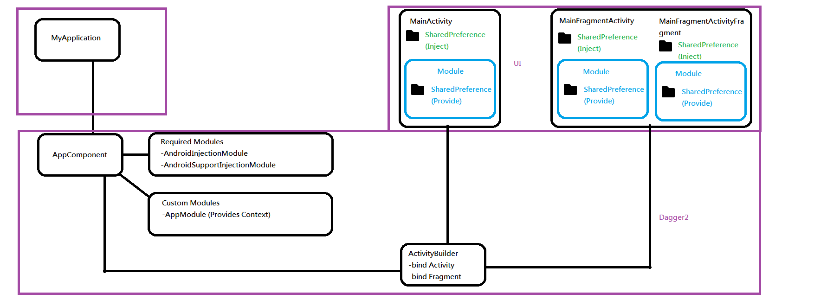

# MyDaggerExample

Very simple Hello World Project using Dagger 2.11, Android Studio 3.0 beta-2

Following the example from 
https://medium.com/@iammert/new-android-injector-with-dagger-2-part-1-8baa60152abe

# Structure
<p>

</p>

# App Components
```
@Component(modules = {
    AndroidInjectionModule.class, AndroidSupportInjectionModule.class,
    AppModule.class,
    ActivityBuilder.class})
public interface AppComponent {
 ...
}
```
# Custom Modules
```
@Module
public class AppModule {

  @Provides
  @Singleton
  Context provideContext(Application application) {
    return application;
  }

}
```

# ActivityBuilder
```
@Module
public abstract class ActivityBuilder {

  @ContributesAndroidInjector(modules = MainActivity.MainActivityModule.class)
  abstract MainActivity bindMainActivity();

  @ContributesAndroidInjector(modules = MainFragmentActivity.MainFragmentActivityModule.class)
  abstract  MainFragmentActivity bindMainFragmentActivity();

  @ContributesAndroidInjector(modules = MainFragmentActivityFragment.MainFragmentActivityFragmentModule.class)
  abstract MainFragmentActivityFragment bindMainFragmentActivityFragment();

}
```

# One of the sample Activity
```
public class MainActivity extends DaggerAppCompatActivity {
  @Inject SharedPreferences sharedPreferences;

  @Override
  protected void onCreate(Bundle savedInstanceState) {
    super.onCreate(savedInstanceState);
    setContentView(R.layout.activity_main);
    TextView textView1 = findViewById(R.id.textView1);
    textView1.setText(sharedPreferences.getString("sample","I am hello world2"));

  }

  /**
   * Created by Charles Ng on 26/9/2017.
   */

  @Module
  @Singleton
  public static class MainActivityModule {

    @Provides
    SharedPreferences provideSharedPreferences(MainActivity mainActivity){
      return PreferenceManager.getDefaultSharedPreferences(mainActivity);
    }

  }
}
```

# Application
```
public class MyApplication extends Application implements HasActivityInjector {

  @Inject
  DispatchingAndroidInjector<Activity> activityDispatchingAndroidInjector;

  @Override
  public void onCreate() {
    super.onCreate();
    DaggerAppComponent.builder()
        .application(this)
        .build().inject(this);
  }


  @Override
  public AndroidInjector<Activity> activityInjector() {
    return activityDispatchingAndroidInjector;
  }
}
```

